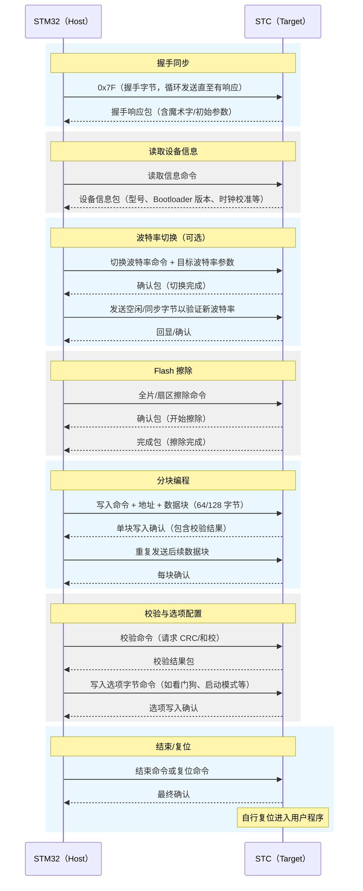

# STC 与 STM32 从握手到烧录校验的通信流程

本文档以 STM32 作为主机、STC 单片机作为目标机，描述从握手、擦除、烧录到校验完成的典型通信过程。每个步骤都标明了发送与接收的先后顺序，并配合时序示意图帮助理解。

## 流程概览

- **物理层**：UART（默认 2400 bps 握手波特率，后续切换到更高传输速率）。
- **数据帧格式**：8 数据位、1 停止位、偶校验（部分型号为无校验，可按型号调整）。
- **角色定义**：
  - **STM32（Host）**：主控侧，发起命令并处理响应。
  - **STC（Target）**：从机侧，根据指令执行擦除、编程、校验等操作。

## 全流程时序示意

## 分阶段详细步骤

### 1. 握手同步

| 顺序 | 发送方 | 接收方 | 数据/操作 | 说明 |
| --- | --- | --- | --- | --- |
| 1 | STM32 | STC | **0x7F**（握手字节） | 周期性发送，确保复位后能捕获到目标机 | 
| 2 | STC | STM32 | 握手响应包（通常含魔术字、默认波特率提示） | 若未收到需重试或检查复位时序 |
| 3 | STM32 | STC | 可选：再次发送 0x7F 确认链路稳定 | 部分型号要求二次确认 |

### 2. 读取设备信息

| 顺序 | 发送方 | 接收方 | 数据/操作 | 说明 |
| --- | --- | --- | --- | --- |
| 1 | STM32 | STC | 读取信息命令 | 请求芯片型号、Bootloader 版本、校准值 |
| 2 | STC | STM32 | 设备信息包 | 依据返回的魔术字对照数据库识别具体型号 |

### 3. 切换波特率（可选但常见）

| 顺序 | 发送方 | 接收方 | 数据/操作 | 说明 |
| --- | --- | --- | --- | --- |
| 1 | STM32 | STC | 切换波特率命令 + 目标波特率参数 | 如 57600/115200 bps，缩短烧录时间 |
| 2 | STC | STM32 | 确认包 | 表示已接收并开始切换 |
| 3 | STM32 | STC | 在新波特率下发送空闲/同步字节 | 验证双方已切换成功 |
| 4 | STC | STM32 | 回显/确认 | 确认新波特率正常工作 |

### 4. Flash 擦除

| 顺序 | 发送方 | 接收方 | 数据/操作 | 说明 |
| --- | --- | --- | --- | --- |
| 1 | STM32 | STC | 全片或扇区擦除命令 | 根据固件大小选择擦除范围 |
| 2 | STC | STM32 | 确认包 | 表示开始擦除 |
| 3 | STC | STM32 | 完成包 | 擦除成功（失败需重试或降波特率） |

### 5. 分块编程

| 顺序 | 发送方 | 接收方 | 数据/操作 | 说明 |
| --- | --- | --- | --- | --- |
| 1 | STM32 | STC | 写入命令 + 起始地址 + 数据块（64/128 字节） | 数据块通常带长度、地址和校验字段 |
| 2 | STC | STM32 | 写入确认/校验结果 | 通过和校或 CRC 验证当前块 |
| 3 | STM32 | STC | 下一数据块 | 直至全部固件发送完成 |
| 4 | STC | STM32 | 每块确认 | 若连续失败应回滚或重新握手 |

### 6. 校验与选项配置

| 顺序 | 发送方 | 接收方 | 数据/操作 | 说明 |
| --- | --- | --- | --- | --- |
| 1 | STM32 | STC | 校验命令（请求整片 CRC/和校） | 确认 Flash 数据完整 |
| 2 | STC | STM32 | 校验结果包 | 与主控端计算结果比对 |
| 3 | STM32 | STC | 写入选项字节命令（若需要） | 配置启动模式、WDT、时钟源等 |
| 4 | STC | STM32 | 选项写入确认 | 失败时应终止，避免错误配置 |

### 7. 结束与复位

| 顺序 | 发送方 | 接收方 | 数据/操作 | 说明 |
| --- | --- | --- | --- | --- |
| 1 | STM32 | STC | 结束命令或软复位命令 | 通知烧录完成 |
| 2 | STC | STM32 | 最终确认 | 表示协议结束 |
| 3 | （STC 自行） | （运行用户代码） | 上电/软复位进入用户程序 | 若有需要，可再次发送 0x7F 以验证重新进入 ISP |

## 关键实现提示

- **复位时序**：保持 STC 的 RST 低电平至少 20–40 ms 后释放，并在 30 ms 内开始发送 0x7F，可显著提高握手成功率。
- **超时管理**：对握手、擦除、编程和校验分别设置独立超时，便于定位异常（如握手超时、单块写入超时）。
- **重试策略**：握手与单块写入建议采用 3 次以内的重试机制；连续失败应回退到握手阶段，避免在高波特率下无限重试。
- **波特率切换安全性**：切换命令后先清空 FIFO，再以新波特率发送短同步字节验证，避免因残留数据导致误判。
- **日志记录**：在 STM32 侧打印“命令 -> 响应”的顺序日志，可直接对应上表，便于调试与现场问题定位。
